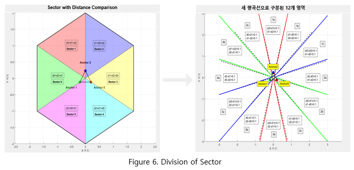
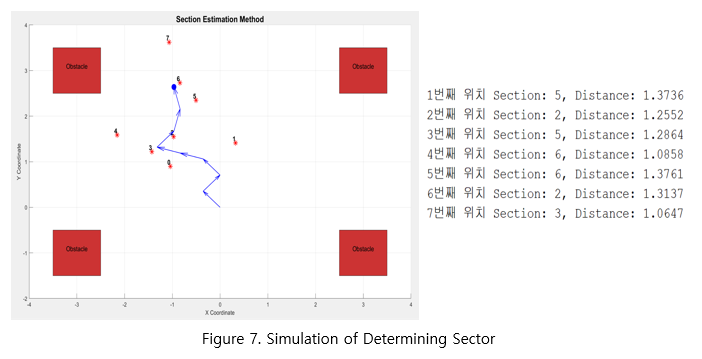
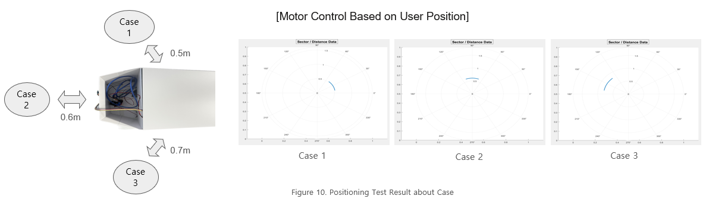
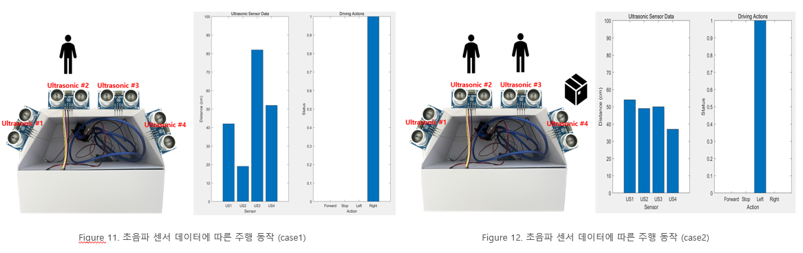
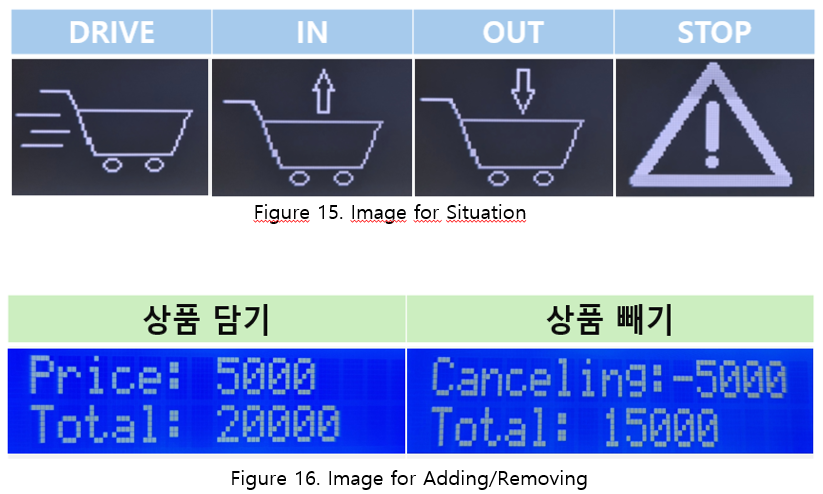
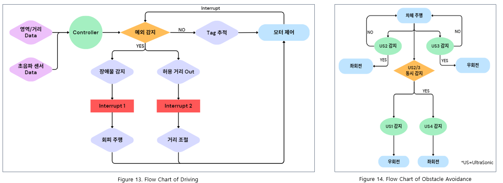
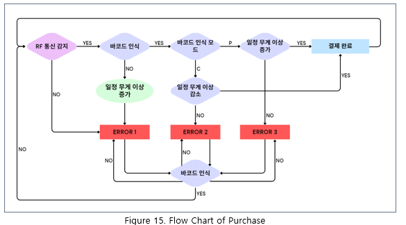
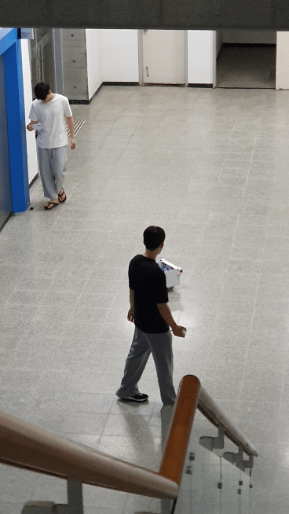

# UWB-Based User Tracking Smart Shopping Cart

## Overview
This project combines **Ultra-Wideband (UWB)** technology, barcode recognition, weight sensors, and both **OLED/LCD** to track a user indoors and provide a more personalized and efficient shopping experience. By accurately determining user position and integrating various sensors, the system can autonomously follow the user carrying the user-held device while automatically avoiding obstacles and walls.

## Key Features
1. **UWB Positioning**  
   - Uses Time of Flight (ToF) methods (e.g., Two-Way Ranging, TWR) to measure distances between anchors and tags.  
   - Initially implemented trilateration, but due to significant errors, adopted a new "region determination" method. This approach compares the three distance measurements to classify the tag location into one of six predefined regions.
   - Supports dynamic or moving tags and adaptively updates positions in real time.
      
     
     

2. **Motorized Alignment Algorithm**  
   - Operational area is divided into zones (1a–4c) based on UWB positioning.
   - Initial alignment involves rotating a single motor to position the Tag into zone 1a, followed by dual-motor operation to reduce distance (d2) between device and user.
   - Early approach caused alignment errors due to communication delays (UWB-Arduino-RF).
   - Improved by applying predefined motor rotation angles based on Tag zones, ensuring accurate alignment to zone a1.
   - RF communication instability at greater distances was resolved by initiating immediate forward motion upon alignment.
      
     

3. **Obstacle Detection and Avoidance**
   - Four ultrasonic sensors installed (front-left, front-right, 45° left, and 45° right) for accurate obstacle detection.
   - When an obstacle is detected during motor operation, the system immediately interrupts, stops, and avoid obstacle.
   - Specific avoidance actions are triggered based on sensor readings falling below predefined thresholds.
   - Initially evaluates obstacles using two front sensors; if both sensors detect equal distances, additional comparison of 45° sensors determines avoidance direction.
      
     
   
4. **Barcode & Weight Sensor Integration**  
   - The user-held device functions as both a UWB tag and a barcode reader.
   - Scanned barcode data (item name and price) is displayed on the LCD screen, with an option to cancel via a dedicated cancel button.
   - Weight sensors detect weight changes upon barcode scanning to prevent theft or unauthorized item removal.
   - The onboard OLED display visually informs users about their current status or situation.
      
     

## Flow charts
Below are the Korean flowcharts for this project.
 

 

 

## Advantages
- **High Accuracy**: Employs UWB for reliable short-range positioning with minimal interference. 
- **Cost-Effective**: Enables user tracking at significantly lower costs compared to traditional camera-based tracking systems.
- **User-Centric Interaction**: Automated alignment and context-sensitive information enhance usability.

## Conclusion
By integrating UWB location tracking, sensor fusion (barcode and weight data), and dynamic display control, this system creates an interactive environment that adapts to users in real time. Its modular design allows it to be extended for diverse use cases, such as retail kiosks, smart shelves, and other IoT-driven interactive systems.

## Demo

